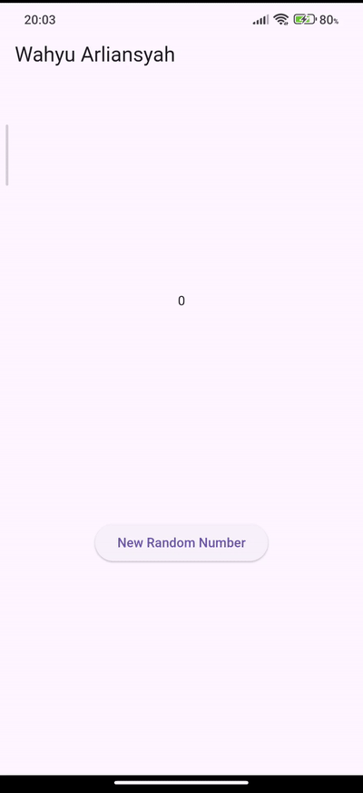
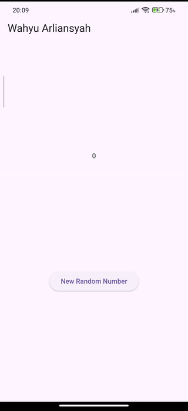
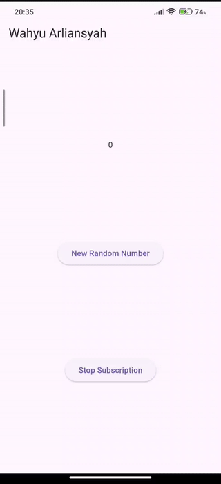
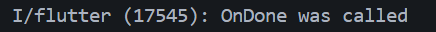

# Stream Wahyu Arliansyah

# Soal 1

Ganti title dengan nama panggilan

```Dart
 return MaterialApp(
      title: 'Wahyu Arliansyah',
      theme: ThemeData(primarySwatch: Colors.blue),
      home: const StreamHomePage(),
    );
```

# Soal 2

Ganti 5 warna sesuai keinginan

```Dart
final List<Color> colors = [
    Colors.red,
    Colors.green,
    Colors.blue,
    Colors.yellow,
    Colors.orange,
  ];
```

# Soal 3

1. `yield*` dalam code ini berfungsi untuk mendelegasikan semua nilai yang dihasilkan oleh `Stream.periodic` ke stream yang sedang dibangun, `Stream.periodic` akan menghasilkan warna dari list `colors` setiap 1 detik.
2. Code ini bermaksud untuk membuat suatu `stream` yang mengeluarkan warna setiap 1 detik secara berulang-ulang dari list warna yang udah dibuat diatas.

# Soal 4


# Soal 5

Perbedaan antara menggunakan `listen` dan `await for`

1. `listen` Eksekusi kode berlanjut setelah pemanggilan dan lebih cocok untuk UI karena non-blocking dan lebih mudah dikontrol (bisa di-cancel)
2. `await for` kode akan berhenti ketika sudah berhenti looping (karena menggunakan `stream periodic` jadi tidak akan pernah berhenti/selesai).

# Soal 6

1. Pengertian praktikum 8 dan 10
   Praktikum 8

   ```Dart
   void initState() {
    numberStream = NumberStream();
    numberStreamController = numberStream.controller;
    Stream stream = numberStreamController.stream;
    stream.listen((event) {
      setState(() {
        lastNumber = event;
      });
    });
    super.initState();
   }
   ```

   Persiapan stream ketika wigdet pertama kali dibuat, membuat sistem untuk menerima data angka yang dikirim melalui stream, dan setiap ada angka yang baru, akan update `lastNumber` dan rebuild wigdet.

   Praktikum 10

   ```Dart
     void addRandomNumber() {
    Random random = Random();
    int myNum = random.nextInt(10);
    numberStream.addNumberToSink(myNum);
   }
   ```

   Maksud dari kode ini adalah membuat angka yang random/acak dari 0-9, ngirim angka ke stream lewat sink dan angka ini akan nerima oleh listener di `initState()` dan memperbarui UI.

2. 

# Soal 7

### Langkah 13

```Dart
addError() {
    controller.sink.addError("Error");
  }
```

method `addError` berfungsi untuk mengirimkan error/kesalahan ke dalam stream dengan pesan `Error`

### Langkah 14

```Dart
void initState() {
    numberStream = NumberStream();
    numberStreamController = numberStream.controller;
    Stream stream = numberStreamController.stream;
    stream
        .listen((event) {
          setState(() {
            lastNumber = event;
          });
        })
        .onError((error) {
          setState(() {
            lastNumber = -1;
          });
        });
    super.initState();
  }
```

Dibaris `.onError((error)` bermaksud untuk callback yang mendengarkan jika ada kesalahan distream.
Dibaris `setState(() { lastNumber = -1; });` jika ada kesalahan, maka nilai diubah menjadi -1.

### Langkah 15

```Dart
  void addRandomNumber() {
    Random random = Random();
    // int myNum = random.nextInt(10);
    // numberStream.addNumberToSink(myNum);
    numberStream.addError();
  }
```

Baris `numberStream.addError();` bermaksud untuk menambahkan kesalahan kedalam stream.

### Mengembalikan codingan seperti semula

```Dart
void addRandomNumber() {
    Random random = Random();
    int myNum = random.nextInt(10);
    numberStream.addNumberToSink(myNum);
    // numberStream.addError();
  }
```

# Soal 8

### Langkah 1

```Dart
  late StreamTransformer transformer;
```

Codingan ini merupakan deklarasi variabel yang akan menyimpan objek `StreamTransformer`.

### Langkah 2

```Dart
transformer = StreamTransformer<int, int>.fromHandlers(
      handleData: (value, sink) {
        sink.add(value * 10);
      },
      handleError: (error, track, sink) {
        sink.add(-1);
      },
      handleDone: (sink) => sink.close(),
    );
```

Codingan ini bermaksud untuk mengkonversi atau memodifikasi data yang berjalan melalui stream.

### Langkah 3

```Dart
stream.transform(transformer)
```

Codingan ini bermaksud untuk menginisialisasi sebelum digunakan agar tidak terjadi error `LateInitializationError`.

### Hasil GIF



# Soal 9

### Langkah 2

```Dart
subscription = stream.listen((event) {
      setState(() {
        lastNumber = event;
      });
    });
```

`stream.listen` adalah metode yang digunakan untuk mendengarkan (subscribe) ke sebuah stream.

### Langkah 6

```Dart
subscription.cancel();
```

`subscription.cancel();` berfungsi untuk memberhentikan subscribe(langganan) ke dalam stream.

### Langkah 8

```Dart
if (!numberStreamController.isClosed) {
      numberStream.addNumberToSink(myNum);
    } else {
      setState(() {
        lastNumber = -1;
      });
    }
```

`numberStreamController.isClosed` Berfungsi untuk memeriksa apakah stream sudah ditutup atau belum. `numberStream.addNumberToSink(myNum)` Digunakan untuk menambahkan data baru ke dalam stream jika stream masih terbuka. `setState(() { lastNumber = -1; });` Digunakan untuk menandakan kesalahan atau kondisi stream yang tidak dapat digunakan lagi.

## Hasil capture

### Hasil GIF



### Hasil di Debug Console


