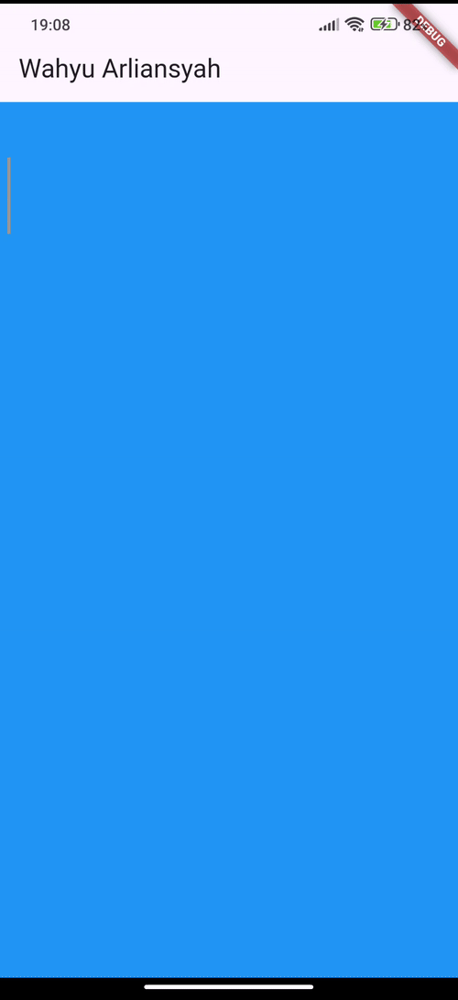

# Stream Wahyu Arliansyah

# Soal 1

Ganti title dengan nama panggilan

```Dart
 return MaterialApp(
      title: 'Wahyu Arliansyah',
      theme: ThemeData(primarySwatch: Colors.blue),
      home: const StreamHomePage(),
    );
```

# Soal 2

Ganti 5 warna sesuai keinginan

```Dart
final List<Color> colors = [
    Colors.red,
    Colors.green,
    Colors.blue,
    Colors.yellow,
    Colors.orange,
  ];
```

# Soal 3

1. `yield*` dalam code ini berfungsi untuk mendelegasikan semua nilai yang dihasilkan oleh `Stream.periodic` ke stream yang sedang dibangun, `Stream.periodic` akan menghasilkan warna dari list `colors` setiap 1 detik.
2. Code ini bermaksud untuk membuat suatu `stream` yang mengeluarkan warna setiap 1 detik secara berulang-ulang dari list warna yang udah dibuat diatas.

# Soal 4


